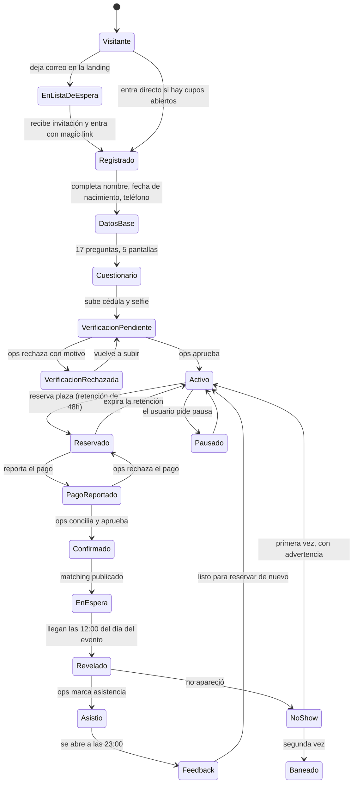

# Aro Club — Brief de producto para diseño

Documento de entrada para el equipo de diseño. Contiene el producto completo, todos los
flujos y todos los estados. **No contiene decisiones visuales**: la dirección de arte, la
tipografía, el color, el ritmo y la personalidad los define diseño a partir de las
referencias que entregue el cliente por separado.

---

## 0. Qué esperamos de esta entrega

**Construye un sistema de diseño, no una colección de pantallas.**

1. **Tokens primero.** Color, tipografía, escala de espaciado, radios, sombras, duraciones
   de animación, breakpoints. Todo con nombre semántico (`surface-raised`, `text-muted`,
   `border-strong`), nunca valores sueltos en las pantallas.
2. **Componentiza todo.** Si un patrón aparece dos veces, es un componente con variantes y
   estados, no dos maquetas parecidas. En §8 hay un inventario mínimo de componentes que
   deben existir.
3. **Cada componente con sus estados completos:** normal, hover, foco (visible por teclado),
   activo, cargando, deshabilitado, error, vacío. Las pantallas de este documento asumen que
   esos estados existen.
4. **Móvil primero, de verdad.** No es "el desktop encogido". La mayor parte del uso ocurre
   de pie, con una mano, con mala señal y a veces con poca luz. Diseña móvil y después
   expande. Entrega ambos.
5. **Dos productos distintos:** la app de miembro y el panel de operación (§3). Comparten
   tokens y primitivos, pero tienen densidad de información opuesta.
6. **Si algo no está en este documento, pregunta.** No inventes funcionalidad. Si detectas
   un hueco real de flujo, señálalo antes de resolverlo por tu cuenta.

**Qué es "web y mobile" aquí:** una sola aplicación web responsive, instalable como PWA. No
hay app nativa iOS ni Android. No diseñes patrones nativos (tab bar de iOS, navigation
drawer de Material). Diseña web que se sienta bien en un teléfono.

---

## 1. Qué es Aro Club

Seis desconocidos verificados se sientan a cenar una vez por semana en el este de Caracas.
El usuario se registra, responde un cuestionario, verifica su identidad, reserva, paga, y el
día del evento a las 12:00 descubre el restaurante, su número de mesa y quiénes son sus
cinco acompañantes.

**A quién le hablamos.** Personas de 28 a 45 años en Caracas cuyo círculo social se rompió
por la diáspora. Gente que se fue y volvió, gente que nunca se fue y vio irse a todos, gente
que se mudó del interior, extranjeros residentes, y venezolanos que viven fuera y están de
visita.

**El posicionamiento no es "conoce desconocidos". Es "reconstruye tu círculo".** Es un
matiz que lo cambia todo: no vendemos novedad, vendemos recuperar algo que se perdió.

### Lo que Aro Club NO es

Esto no es una lista de funcionalidades pendientes. Son ausencias deliberadas y el diseño
debe defenderlas:

- **No hay fotos de perfil.** Nunca. No diseñes un avatar con foto real de usuario.
- **No hay swipe, ni likes, ni match uno a uno.**
- **No hay perfiles públicos.** Nadie puede navegar la base de miembros.
- **No hay chat dentro de la app.**
- **No hay badges, niveles, rachas ni gamificación.**
- **No es una app de citas.** Si una pantalla se puede leer como Tinder, está mal diseñada.

La ausencia de foto es el producto: quita la evaluación física de la ecuación y es la razón
por la que alguien se sienta con seis desconocidos sin sentirse en una cita.

---

## 2. Seis principios que deben guiar cada decisión

1. **La información se revela por capas y a horas fijas.** El usuario nunca lo sabe todo de
   golpe. Esa dosificación es el motor emocional del producto: convierte la ansiedad de
   "voy a cenar con desconocidos" en expectativa. El diseño tiene que hacer que la espera se
   sienta como algo que avanza, no como una pantalla que no cambia.

2. **La seguridad se muestra, no se asume.** Verificar la cédula es un costo para el
   usuario. Si no ve nada a cambio, es solo un trámite. Cada vez que sea cierto y relevante,
   el producto debe recordarle que las otras cinco personas pasaron exactamente el mismo
   control. Para una mujer decidiendo si va sola a las 19:00, ese es el argumento decisivo.

3. **Siempre hay un solo siguiente paso, y siempre está visible.** El recorrido tiene ocho
   estados. Nadie debería preguntarse nunca "¿y ahora qué?".

4. **Español de Venezuela, y de una persona a otra.** Nada de "Something went wrong". Los
   errores dicen qué pasó y qué hacer. Sin emojis decorativos en la interfaz.

5. **Diseña para mala señal y para poca luz.** La pantalla más importante del producto se
   consulta parado en la calle buscando la entrada de un restaurante.

6. **El panel de operación es producto de primera clase.** El equipo va a pasar más horas
   ahí que ningún usuario en la app. Un panel mal diseñado se paga en errores humanos que
   afectan a comensales reales.

---

## 3. Las dos aplicaciones

### 3.1 App de miembro
Público general y usuarios autenticados. Densidad baja, una decisión por pantalla, texto
generoso, ritmo pausado. Es un producto de confianza: la calma comunica seguridad.

### 3.2 Panel de operación (`/ops`)
Uso interno, tres o cuatro personas, sesiones largas, mucha lectura y mucha decisión
repetitiva. Densidad alta, tablas, atajos de teclado, acciones masivas, todo escaneable.
Prioriza velocidad de operación sobre elegancia. Aquí sí: información densa, tipografía más
pequeña, filas compactas.

Ambos comparten tokens, tipografía y primitivos. No son dos marcas.

---

## 4. La máquina de estados del miembro

Esto gobierna el componente "tu siguiente paso" (§6, F6) y hay que respetarlo en todos los flujos.

Reglas duras que el diseño no puede saltarse:

- **Sin verificación aprobada no se puede reservar.** Sin excepciones, ni para invitados.
- Un evento cancelado por falta de mesas devuelve créditos o reembolsa.
- El feedback persona a persona **jamás** es visible para la persona valorada.

---

## 5. El ciclo semanal

| Cuándo | Qué pasa | Dónde se ve |
|---|---|---|
| Toda la semana | Inscripción abierta | App de miembro |
| 48h antes | Cierra la inscripción | Cuenta atrás visible en el evento |
| 48h antes | Se abre la vista previa de la mesa | App de miembro |
| Lunes | Operaciones corre el matching | Panel |
| Día del evento, 12:00 | Se revela restaurante y mesa | App de miembro |
| Día del evento, 19:00 | La cena | — |
| Día del evento, 23:00 | Se abre el feedback | App de miembro |

Las horas son parte del producto. El diseño debe mostrarlas siempre y hacer visible cuánto
falta para la siguiente.

---

## 6. Flujos de la app de miembro

Para cada flujo: propósito, pantallas, estados obligatorios y qué nunca se muestra.

---

### F1 — Landing pública

**Propósito.** Explicar el producto y capturar la lista de espera. La captación empieza el
día uno, mucho antes de que haya eventos.

**Secciones.**
1. Hero. La promesa en una frase. Sin fotos de gente sonriendo genérica de banco de imágenes.
2. Cómo funciona, en cuatro pasos: respondes, verificamos, reservas, cenas.
3. Por qué no es una app de citas. Sección explícita: sin fotos, sin swipe, sin perfiles.
4. Cómo cuidamos la mesa: verificación de identidad, zonas, hora temprana, balance de la mesa.
5. Precio, transparente. Cuánto cuesta Aro y cuánto cuesta aparte la cena.
6. Preguntas frecuentes.
7. Formulario de lista de espera.

**Formulario.** Nombre, correo, teléfono (opcional), cómo nos conociste, zona donde te
queda cómodo salir.

**Estados.** Vacío · enviando · éxito · correo ya registrado (no es un error, es "ya estás
en la lista, te escribimos cuando abramos tu zona").

**Detalle con intención.** Un indicador de densidad del tipo *"faltan 34 personas para abrir
la primera mesa en Las Mercedes"*. Hace dos cosas: da prueba social y explica por qué hay
que esperar. Diséñalo como algo que avanza, no como una barrera.

**Nunca se muestra:** cuántos miembros hay en total, ni nombres, ni testimonios inventados.

---

### F2 — Acceso

**Propósito.** Entrar. Solo enlace mágico por correo. **No hay contraseñas en este producto.**
No diseñes campo de contraseña, ni "olvidé mi contraseña", ni "entrar con Google".

**Pantallas.**
1. Un solo campo de correo y un botón.
2. "Revisa tu correo": qué buscar, de qué remitente, y un reenviar con temporizador.
3. Enlace expirado o ya usado. Es un estado frecuente y necesita pantalla propia, no un error genérico.
4. Enlace abierto en otro dispositivo del que lo pidió: hay que explicarlo sin asustar.

---

### F3 — Datos base

**Propósito.** Lo mínimo para poder sentar a alguien en una mesa.

**Campos.** Nombre completo · cómo quieres que te llamen (es lo único que ven los demás) ·
fecha de nacimiento · género · teléfono en formato venezolano · zona donde vives.

**Copy crítico.** Pedir fecha de nacimiento y género sin explicar por qué se lee como app de
citas. El diseño debe llevar la explicación al lado del campo: la edad se usa para que la
mesa tenga referencias parecidas, el género para que la mesa esté balanceada. No es un
formulario, es una conversación corta.

**Teléfono.** Prefijo +58 fijo y validación de operadora (0412, 0414, 0416, 0424, 0426). Es
el canal por el que se recibe todo, así que el error tiene que ser muy claro.

---

### F4 — Cuestionario

**Propósito.** Alimentar el algoritmo que arma las mesas. 17 preguntas, 5 pantallas.

**Requisitos.**
- Barra de progreso siempre visible, por pantalla y no por pregunta.
- **Guardado incremental.** El usuario puede abandonar y volver. Al volver, retoma donde
  quedó, con un mensaje que lo diga.
- Cada pantalla tiene un título que explica para qué sirve lo que se está preguntando.
- Las multi-selección con mínimo y máximo muestran el contador ("elige 3 a 6", "te faltan 2").
- Al terminar, pantalla de transición que celebra sin exagerar y anuncia el siguiente paso.

**Pantalla 1 — Tu contexto**

| Pregunta | Tipo | Opciones |
|---|---|---|
| ¿Cuál de estas se parece más a tu historia? | única | Me fui del país y volví · Nunca me fui de Venezuela · Me mudé a Caracas desde el interior · Soy extranjero viviendo aquí · Vivo en el exterior y estoy de visita |
| ¿En qué sector trabajas? | única | 20 sectores (tecnología, finanzas, salud, educación, consultoría, legal, marketing, medios, diseño, comercio, manufactura, energía, construcción, gastronomía, ONG, gobierno, emprendo por mi cuenta, estudio, entre trabajos, otro) |
| ¿Dónde trabajas actualmente? | texto con autocompletado | Ayuda: *"Solo lo usamos para intentar no sentarte con alguien de tu empresa. No se le muestra a nadie."* |
| ¿En qué momento estás? | única | Soltero sin hijos · Soltero con hijos · En pareja sin hijos · En pareja con hijos · Prefiero no decirlo |

**Pantalla 2 — Cómo eres en la mesa**

| Pregunta | Tipo | Opciones |
|---|---|---|
| En una mesa con gente que no conoces, ¿cómo eres? | única | Escucho más de lo que hablo · Depende del momento · Suelo llevar la conversación |
| ¿Qué te trae? | única | Ampliar mi círculo · Volver a salir después de un tiempo · Conocer gente fuera del trabajo · Reconectar con Caracas después de volver · Red profesional |
| Aro no es una app de citas, pero a veces pasa. ¿Cómo lo ves? | única, opcional | Abierto, si surge algo bienvenido · Me da igual, vengo por la conversación · Prefiero una mesa sin esa energía |
| Escoge lo que de verdad haces, no lo que te gustaría hacer | múltiple, 3 a 6 | ~27 actividades |

La tercera es delicada. **Nunca se muestra a nadie, jamás, bajo ningún estado del producto.**
El copy debe dejarlo explícito en la misma pantalla. Diséñala sin corazones, sin rosa, sin
ningún signo visual de romance: es una pregunta más.

**Pantalla 3 — De qué hablas**

| Pregunta | Tipo | Opciones |
|---|---|---|
| ¿De qué podrías hablar dos horas seguidas? | múltiple, 2 a 4 | 18 temas |
| ¿Hay algún tema que prefieras que no salga? | múltiple, opcional | Política y situación del país · Religión y fe · Dinero, sueldos y precios · Vida amorosa y relaciones · Crianza e hijos · Trabajo, vengo a desconectarme · Ninguno, hablo de todo |

"Ninguno" es exclusiva: marcarla desmarca las demás y viceversa.

**Pantalla 4 — Qué buscas y cuánto**

| Pregunta | Tipo | Opciones |
|---|---|---|
| ¿Qué planes te interesan? | múltiple | Cena en restaurante · Cena con foco gastronómico · Café o desayuno de networking · Drinks / after office · Correr · Senderismo · Pádel o tenis · Yoga o pilates · Ciclismo |
| En una cena, ¿qué pesa más para ti? | única | La conversación, el restaurante es la excusa · Las dos cosas por igual · La comida, vengo por la experiencia gastronómica |
| ¿Cuánto piensas gastar en la cena, sin contar lo que pagas aquí? | única | Hasta 20 USD · 20 a 35 · 35 a 50 · Más de 50 |
| ¿Alguna restricción alimentaria? | múltiple, opcional | Ninguna · Vegetariano · Vegano · Pescetariano · Sin gluten · Sin lactosa · Kosher · Halal · No como cerdo · No como carnes rojas · Diabético · Alergias (texto libre) |

El rango de gasto necesita copy que quite la carga social de elegir el más bajo. La queja
número uno del producto de referencia es que te mandan a un sitio más caro del que elegiste;
esta pregunta es la que lo evita, así que tiene que responderse con honestidad.

**Pantalla 5 — Logística**

| Pregunta | Tipo | Opciones |
|---|---|---|
| ¿En qué zonas puedes asistir sin problema? | múltiple | Las Mercedes · El Rosal · Bello Monte · Chacao · Altamira · La Castellana · Los Palos Grandes · Sebucán y Los Dos Caminos · Chuao · El Cafetal y Santa Paula · Los Naranjos y Cerro Verde · La Trinidad y La Tahona · El Hatillo |
| ¿Qué días te sirven mejor? | múltiple | Martes noche · Miércoles noche · Jueves noche · Viernes noche · Sábado noche · Sábado mediodía · Domingo mediodía |
| ¿En qué idiomas conversas cómodo? | múltiple | Español · Inglés · Portugués · Italiano · Francés · Alemán · Árabe · Chino |

Español viene preseleccionado.

---

### F5 — Verificación de identidad

**Propósito.** Sin esto no se reserva. Es la promesa central de seguridad del producto.

**Pantallas.**
1. Explicación antes de pedir nada: qué pedimos, para qué, quién lo ve, dónde se guarda,
   cuánto tarda. Esta pantalla decide si la persona abandona.
2. Cédula (frente). En móvil, cámara. En escritorio, subir archivo **y un código QR para
   continuar en el teléfono** — mucha gente responde el cuestionario en la laptop y tiene la
   cédula en el móvil. Sin esa salida, se atascan ahí.
3. Selfie. Guía visual de encuadre.
4. Enviado. "Revisamos en menos de 24 horas y te avisamos por WhatsApp."

**Estados.** Sin empezar · subiendo · en revisión · aprobada · rechazada con motivo legible
y botón de reintentar · expirada.

**Motivos de rechazo** que necesitan copy propio: foto borrosa, documento cortado, selfie que
no coincide, documento vencido, no es una cédula.

**Nunca se muestra:** la cédula ni la selfie de nadie más, en ninguna parte del producto de
miembro.

---

### F6 — Home: tu siguiente paso

**Propósito.** Resolver el principio 3. Es la pantalla que más se visita.

**Estructura.** Un bloque grande y único arriba con el siguiente paso. Debajo, lo secundario
(tu próxima cena si existe, historial, accesos a perfil).

**Variantes del bloque principal, una por estado:**

| Estado | Qué dice el bloque | Acción |
|---|---|---|
| Falta cuestionario | Te faltan N preguntas | Continuar |
| Falta verificación | Verifica tu identidad para poder reservar | Verificar |
| Verificación en revisión | La estamos revisando, menos de 24 horas | — (informativo, con calma) |
| Verificación rechazada | Motivo + qué hacer | Volver a subir |
| Activo sin eventos abiertos | Todavía no hay cena abierta en tus zonas | Avísame cuando haya |
| Activo con eventos | Hay una cena el jueves en Las Mercedes | Ver y reservar |
| Reserva sin pagar | Te quedan 41 horas para completar el pago | Pagar |
| Pago en revisión | Recibimos tu reporte, lo revisamos hoy | — |
| Confirmado, faltan más de 48h | Faltan 5 días. Te decimos dónde el jueves a las 12:00 | — |
| Confirmado, faltan menos de 48h | Ya sabemos cómo viene tu mesa | Ver la vista previa |
| Día del evento antes de las 12:00 | Hoy es el día. A las 12:00 sabrás dónde | Cuenta atrás |
| Revelado | Nombre del restaurante, hora y mesa | Ver los detalles |
| Feedback abierto | ¿Cómo estuvo? | Contar cómo fue |
| Pausado | Tu cuenta está en pausa | Reactivar |

---

### F7 — Descubrir y reservar

**Lista de eventos.** Fecha y hora · formato · zona o "zona por revelar" · plazas restantes ·
precio · cuenta atrás al cierre de inscripción.

**Detalle del evento.** Qué incluye y **qué no incluye** (el consumo se paga aparte, en el
sitio, y esto tiene que ser imposible de pasar por alto) · rango de gasto esperado · hora ·
política de cancelación · cuántas plazas quedan.

**Estados.** Plazas disponibles · quedan pocas · lleno (entra en lista de espera) ·
inscripción cerrada · sin eventos en tus zonas · cancelado por falta de mesas.

**Reserva.** Confirmación clara de que la plaza queda retenida 48 horas y de que se pierde si
no se completa el pago. La cuenta atrás debe ser visible desde ese momento.

---

### F8 — Pago

**Propósito.** El usuario paga por fuera, en su banco, y luego reporta el pago aquí. No hay
pasarela. Operaciones concilia a mano.

**Métodos en el MVP:** Pago Móvil y transferencia inmediata. Ambos en bolívares.

**Pantalla de instrucciones.** Por cada método: los datos para copiar (teléfono, banco,
cédula o RIF; o banco, cuenta y titular), cada uno con su botón de copiar individual.

**El monto es lo más importante de la pantalla.** Se muestra en bolívares, en grande, con
botón de copiar. Lleva **céntimos únicos** por pago (Bs 3.482,17 y no Bs 3.482,00) porque
así se identifica automáticamente contra el estado de cuenta del banco. El diseño necesita
un aviso corto y claro: *"Paga el monto exacto, hasta los céntimos. Así identificamos tu pago
sin que tengas que esperar."* Si el usuario redondea, se rompe la conciliación.

También visible: la tasa usada y cuándo se actualizó, más el equivalente en dólares.

**Formulario de reporte.** Referencia (últimos dígitos) · banco desde el que pagó · fecha y
hora · captura del comprobante.

**Estados.** Pendiente de pago con cuenta atrás · reporte enviado · en revisión · confirmado ·
rechazado con motivo y opción de corregir · retención expirada.

**Pack de 4.** Se compra igual (instrucciones + reporte). Una vez acreditado, el usuario tiene
créditos y el checkout de una cena se resuelve aplicando un crédito, sin pasar por pago. Hay
que diseñar: la compra del pack, el saldo de créditos visible, y el checkout con crédito
(que es un solo botón de confirmar).

---

### F9 — La espera y la vista previa de la mesa

**Propósito.** Los cinco días entre pagar y cenar son tiempo muerto, y es donde se pierde a la
gente y donde nacen los no-shows. Hay que llenarlos sin revelar nada.

**Antes de 48h.** Cuenta atrás y una explicación de qué va a pasar y cuándo. Puede incluir
contenido ligero: cómo funciona la noche, qué esperar, cómo llegar.

**Desde 48h antes — "Cómo viene tu mesa".** Solo agregados, **nunca identidades**:

- Rango de edades de la mesa
- Los sectores presentes, sin decir quién es quién
- La mezcla de historias (cuántos volvieron, cuántos nunca se fueron, cuántos están de visita)
- Idiomas que comparten
- Dos o tres intereses que la mesa tiene en común
- El balance de la mesa (tres y tres), porque es una promesa del producto y parte de la
  seguridad percibida

**Nunca se muestra:** nombres, empresas, fotos, apertura romántica, ni nada que permita
identificar a una persona concreta.

---

### F10 — La revelación

**Propósito.** Es el momento del producto. Se abre a las 12:00 del día del evento.

**Antes de las 12:00** no es un error ni una pantalla vacía: es una cuenta atrás diseñada con
intención.

**Contenido, en orden de importancia para alguien parado en la calle:**

1. **Número de mesa, enorme.** Es lo primero que necesita al entrar.
2. **Restaurante:** nombre, dirección, **cómo se ve la fachada** (foto de la entrada, no del
   plato) y botón a mapas.
3. **Hora**, y cuánto falta.
4. **Tus cinco acompañantes:** nombre de pila, sector, y un dato de conversación. Sin
   apellidos, sin fotos, sin contacto, sin empresa.
5. **Sello de confianza:** *"Las seis personas de esta mesa verificaron su identidad."*
   Esta línea es el retorno de lo que costó verificarse en F5.
6. **Rompehielos:** tres o cuatro, construidos con lo que esa mesa tiene en común. No son
   genéricos: el algoritmo ya sabe qué comparten.
7. Botón discreto de escribir a soporte por WhatsApp.

**Requisito técnico que afecta al diseño:** esta pantalla tiene que ser legible sin conexión.
Diseña asumiendo que las imágenes pueden no cargar y que el usuario está en la calle con el
brillo al máximo. Contraste alto, jerarquía brutal, nada esencial dentro de una imagen.

---

### F11 — En la mesa

**Propósito.** Acompañar durante la cena sin robar protagonismo. La gente vino a hablar entre
ella, no a mirar el teléfono.

- Modo de lectura simple: texto grande, alto contraste, pensado para poca luz.
- Los rompehielos se pasan de uno en uno.
- Acceso al número de mesa y a quién es quién.
- **Botón discreto pero encontrable de reportar un problema.** Es una funcionalidad de
  seguridad: tiene que poder usarse sin que el resto de la mesa lo note.

---

### F12 — Feedback

**Propósito.** Alimenta el algoritmo y la métrica que decide si el producto sigue. Se abre a
las 23:00 del mismo día.

**Sobre la noche.** NPS (0-10) · restaurante (1-5) · calidad de la conversación (1-5) · con
cuántas personas intercambiaste contacto · ¿repetirías? · comentario abierto.

**Sobre cada persona.** Aquí hay que tener cuidado: la crítica más repetida al producto de
referencia es que calificar a la gente con estrellas genera incomodidad y contamina la cena.
Diseña esto **sin estrellas y sin notas**, con tres opciones en lenguaje suave:

- Me gustaría volver a coincidir
- Sin más
- Prefiero no coincidir de nuevo

Más una bandera aparte, discreta, para conducta inapropiada, que abre un campo de texto y
escala a operaciones.

**Copy obligatorio:** que esto es privado y que la persona valorada nunca lo va a ver. Sin esa
garantía explícita, la gente miente.

---

### F13 — Perfil y cuenta

Datos personales · respuestas del cuestionario (editables, con aviso de que afecta a futuras
mesas) · estado de verificación · saldo de créditos y movimientos · historial de cenas ·
**personas con las que no quiero coincidir** · pausar cuenta · cerrar sesión · eliminar cuenta.

---

### F14 — Cancelación

Política por plazos, con las consecuencias visibles **antes** de confirmar, no después. El
usuario tiene que ver exactamente qué recupera y qué pierde según cuándo cancela.

---

### F15 — Instalación como PWA

**Cuándo se pide:** después de que la primera reserva quede confirmada. **Nunca en la landing**
ni antes de que la persona haya puesto dinero.

- Android y escritorio: aviso propio que dispara el prompt nativo.
- iOS: no existe prompt. Hay que diseñar instrucciones ilustradas de Compartir → Añadir a
  pantalla de inicio, cortas y con imágenes reales del gesto.
- Descartable, y no se vuelve a pedir en mucho tiempo.

**No hay notificaciones push.** Todo aviso sale por WhatsApp y correo. No diseñes pantallas
de permisos de notificación.

---

## 7. Flujos del panel de operación

### O1 — Tablero de la semana
La foto del ciclo: evento próximo, inscritos, confirmados, pagos por conciliar, verificaciones
en cola, mesas viables. Con alertas: *"quedan 18 horas para el cierre y solo hay 1 mesa
viable"*.

### O2 — Cola de verificaciones
Lista con antigüedad. Vista de documento y selfie lado a lado, con zoom. Aprobar o rechazar
con motivo de una lista predefinida. Atajos de teclado: es la tarea más repetitiva del panel.

### O3 — Conciliación de pagos
Cola de pagos reportados: monto en bolívares con sus céntimos únicos, referencia declarada,
comprobante, método, antigüedad. Aprobar o rechazar con motivo.

Aquí vive también **la tasa del día**: editable, con la fecha de última actualización siempre
visible y **una alerta si tiene más de 24 horas**. Es lo único que convierte el precio en
dólares a lo que la gente paga; si se queda vieja, se pierde dinero o se cobra de más.

### O4 — Restaurantes
CRUD con términos comerciales (menú cerrado, comisión, ticket medio), zona, aforo de mesas,
**nivel de ruido**, estacionamiento, notas de seguridad, foto de la fachada.

El nivel de ruido no es un capricho: una mesa que viene a conversar en un sitio de 85
decibelios es una mesa arruinada, y los mejores sitios gastronómicos suelen ser los más
ruidosos.

### O5 — Eventos
CRUD: formato, fecha y hora, cierre de inscripción, hora de revelación, restaurante, plazas,
mínimo de mesas, precio, franja de edad, zona.

### O6 — Matching
La pantalla más compleja del producto.

1. Lanzar la corrida sobre un evento, con los pesos editables (cohesión 0.30, diversidad de
   sector 0.25, mezcla de historias 0.20, balance de energía 0.15, novedad de red 0.10).
2. **Previsualización sin publicar:** las mesas propuestas, cada una con su puntuación total y
   el desglose por componente, y quién está en ella.
3. **Ajuste manual:** mover personas entre mesas arrastrando. Al mover, las restricciones que
   se rompen se marcan en rojo y explican qué se rompió ("estas dos personas ya coincidieron
   en marzo", "esta mesa quedaría 5-1"). Operaciones siempre puede sobrescribir al algoritmo,
   pero tiene que ver el costo de hacerlo.
4. La gente que quedó fuera del emparejamiento, y por qué.
5. Publicar. Acción irreversible: pide confirmación explícita.

**Restricciones duras que la interfaz debe visualizar cuando se rompen:**
- Diferencia de edad mayor a 10 años en la mesa
- Balance de género fuera de 4-2 (nunca 5-1)
- Dos personas que ya coincidieron en los últimos 6 meses
- Un par que está en la lista de exclusiones
- Dos personas de la misma empresa
- Rango de gasto que abarca más de dos tramos contiguos
- Más de 2 personas "de visita" en la misma mesa

### O7 — Día del evento
Marcar asistencia por mesa. Registrar no-shows (primero advertencia, segundo baneo).
Registrar incidentes con nivel de gravedad.

### O8 — Plantillas de WhatsApp
WhatsApp es manual en esta fase. El panel genera el mensaje ya redactado con los datos de la
persona, y ofrece copiar y abrir `wa.me`. Plantillas necesarias: bienvenida, verificación
aprobada, verificación rechazada, recordatorio de pago, pago confirmado, revelación,
recordatorio del día, evento cancelado, seguimiento de no-show.

### O9 — Fusión de empleadores
Grupos de nombres de empresa parecidos ("banesco", "banco banesco", "BANESCO C.A.") para que
operaciones confirme cuál es el nombre canónico. De esto depende la regla de no sentar a dos
personas de la misma empresa.

### O10 — Métricas
Conversión de lista de espera a cuestionario completo · de cuestionario a verificación
aprobada · ocupación por evento · tasa de no-show · NPS por mesa · **varianza de NPS entre
mesas del mismo evento** · **segunda asistencia a 60 días**.

Las dos últimas van destacadas: son las que deciden si el producto continúa. La varianza
entre mesas es la única forma de saber si el algoritmo aporta algo, porque con el mismo
restaurante y la misma noche, toda la diferencia viene del emparejamiento.

---

## 8. Inventario mínimo de componentes

**Primitivos.** Botón (primario, secundario, terciario, destructivo; con estado de carga) ·
campo de texto · área de texto · selector · casilla · radio · interruptor · etiqueta ·
distintivo de estado · avatar **sin foto** (iniciales o forma geométrica) · separador ·
esqueleto de carga.

**Formulario.** Grupo de campo con etiqueta, ayuda y error · selección única en tarjetas ·
selección múltiple en fichas con contador de mínimo y máximo · selector de tramo · subida de
archivo con vista previa y progreso · captura de cámara · campo de teléfono venezolano ·
autocompletado.

**Navegación.** Cabecera de miembro · cabecera de operación · barra de progreso por pasos ·
migas · pestañas · retroceso.

**Retroalimentación.** Aviso (información, éxito, advertencia, error) · notificación efímera ·
diálogo modal · confirmación de acción destructiva · estado vacío (con ilustración y acción) ·
estado de error con reintento.

**Específicos del producto.**
- **Tarjeta de siguiente paso** — con las 14 variantes de §6/F6
- **Tarjeta de evento** — lista y detalle
- **Cuenta atrás** — al cierre de inscripción, a la retención de pago, a la revelación
- **Bloque de datos de pago copiables** — con copiar por campo
- **Monto destacado en bolívares** — con céntimos únicos y aviso
- **Tarjeta de tasa del día** — con antigüedad y alerta
- **Vista previa agregada de mesa** — sin identidades
- **Tarjeta de comensal** — nombre de pila, sector, dato de conversación, sin foto
- **Número de mesa** — enorme, legible a un metro
- **Sello de verificación de mesa**
- **Tarjeta de rompehielos** — pasable
- **Selector de señal por persona** — tres opciones, sin estrellas
- **Insignia de estado de verificación** — pendiente, aprobada, rechazada
- **Indicador de densidad de la lista de espera**

**Solo del panel.** Tabla con orden, filtro y selección múltiple · fila de cola con
antigüedad · visor de documento con zoom · tablero de mesas con arrastrar y soltar · aviso
de restricción rota · editor de pesos · tarjeta de métrica con tendencia · registro de
auditoría.

---

## 9. Copy y tono

- **Español de Venezuela.** Tuteo. Cercano sin ser confianzudo.
- **Nada de emojis en la interfaz.** Los iconos son del sistema de diseño.
- **Los errores dicen qué pasó y qué hacer.** "No pudimos leer tu cédula, la foto salió
  movida. Vuelve a tomarla con más luz" y no "Error de validación".
- **Los tiempos son concretos.** "Menos de 24 horas", no "pronto".
- **Nunca lenguaje de citas.** No "match", no "conexión", no "química". La mesa se "arma",
  no se "empareja".
- **La verificación se pide explicando, no exigiendo.**
- Cuando hables de dinero, siempre queda claro qué paga el usuario a Aro y qué paga en el
  restaurante.

---

## 10. Responsive y accesibilidad

**Breakpoints.** Móvil hasta 640 · tableta 641-1024 · escritorio 1025+. El panel de
operación asume escritorio, pero la cola de verificaciones y el marcado de asistencia tienen
que funcionar en móvil: operaciones los usa desde el restaurante.

**Accesibilidad.** Contraste AA como mínimo, AAA en la pantalla de revelación (se lee en la
calle). Foco visible por teclado en todo. Área táctil mínima de 44px. Nada que dependa solo
del color: los estados llevan además icono o texto. Todo el flujo del cuestionario y del
pago tiene que poder completarse solo con teclado.

**Modo oscuro:** fuera de alcance en esta fase.

---

## 11. Fuera de alcance — no diseñar

Chat dentro de la app · feed social · perfiles públicos · badges, niveles o gamificación ·
notificaciones push · app nativa · pasarela de pago · varias ciudades · varios idiomas de
interfaz · modo oscuro · fotos de perfil en cualquier forma.

Si alguna parece "rápida de añadir", la respuesta es no. Cada una añade superficie de
mantenimiento sobre un producto que todavía no sabe si retiene.
